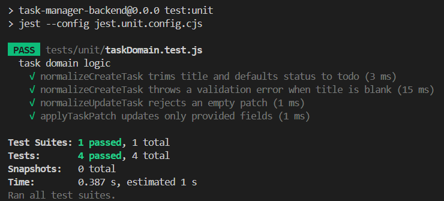
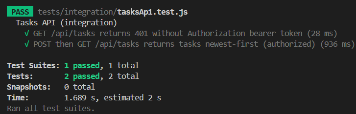
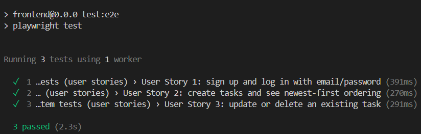
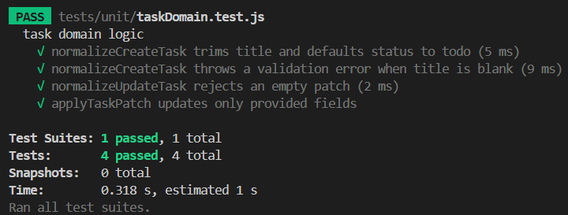
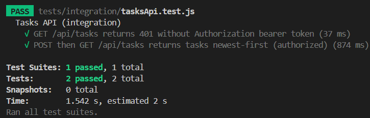
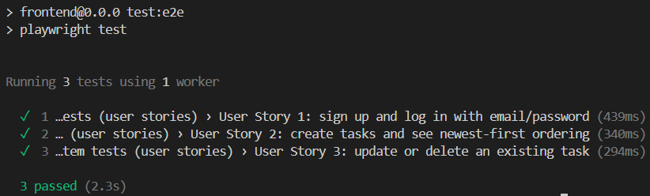
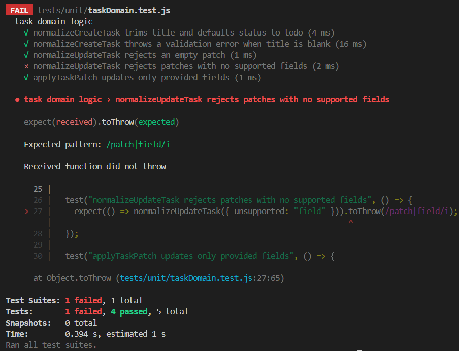
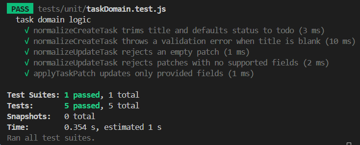

# CMSC 129 Laboratory Assignment 4 — Task Manager (TDD)

Author: **Rei Jansen Buerom**

Live URL: **[TBD]**

## App Description
This project is a single-resource CRUD **Task Manager** built using **Test-Driven Development (TDD)**. Users can **sign up and log in using email/password** and then create, view, update, and delete their own tasks. Tasks are stored in **Firestore**, and the development process follows the **Red → Green → Refactor** cycle with commit history as evidence.

## User Stories
1. As a user, I want to sign up and log in with my email and password, so that I can securely access my own tasks.
2. As a user, I want to create new tasks (with an optional description), so that I can keep track of what I need to do in order of most recently added.
3. As a user, I want to update or delete an existing task, so that I can keep my task list accurate as priorities change or tasks are completed.

## Tech Stack
- **Frontend:** React, TailwindCSS, daisyUI
- **Backend:** Node.js, Express (MVC)
- **Authentication:** Firebase Authentication (Email/Password)
- **Data Storage:** Firestore
- **Testing Tools:**
  - **Unit:** Jest **[TBD]** (pure business logic)
  - **Integration:** Jest + Supertest **[TBD]** (Express API + Firestore via Firebase Admin SDK)
  - **System/E2E:** Playwright **[TBD]** (real browser user journeys)
- **Testing Infrastructure:** Firebase Emulators (Auth + Firestore)
- **CI/CD:** GitHub Actions

## Testing Strategy
This project includes **three testing levels**. Each level is developed using TDD (tests written first, failing in a `[RED]` commit; then minimal implementation in `[GREEN]`; then cleanup in `[REFACTOR]`).

### Unit Tests (Business Logic Only)
Unit tests cover pure, isolated functions such as:
- validating task fields (e.g., `title`, `status`)
- normalizing input for create/update
- applying partial updates (patch semantics)

Unit tests must **not** make HTTP requests and must **not** interact with Firebase/Firestore.

### Integration Tests (Request → Route → Controller → Firestore)
Integration tests cover at least one full request/response cycle through the Express API with real wiring:
- Express route + controller + repository/data layer
- Firebase Authentication via **Bearer token** (`Authorization: Bearer <idToken>`)
- Firestore reads/writes via **Firebase Admin SDK**
- Firestore emulator for deterministic testing

Integration tests will include behavior such as:
- creating tasks
- listing tasks **sorted newest-first**
- partially updating tasks (only fields provided change)
- deleting tasks

### System / E2E Tests (Real Browser User Journeys)
System tests use Playwright to simulate real user behavior in a browser and will include **one test per user story**:
- sign up / log in
- create tasks and verify newest-first ordering in the UI
- update and delete tasks

These tests run against the full app (frontend + backend) configured to use Firebase Emulators.

## Setup Instructions
> Note: Commands will be finalized as the project is built. Placeholders are marked **[TBD]**.

### 1) Clone
```bash
git clone [TBD_REPO_URL]
cd CMSC129-Lab4-BueromRJ
```

### 2) Install Dependencies
Frontend:
```bash
cd [TBD_FRONTEND_DIR]
[TBD_INSTALL_CMD]
```

Backend:
```bash
cd [TBD_BACKEND_DIR]
[TBD_INSTALL_CMD]
```

### 3) Start Firebase Emulators (Auth + Firestore)
```bash
[TBD_FIREBASE_EMULATOR_CMD]
```

### 4) Run Unit Tests
```bash
[TBD_UNIT_TEST_CMD]
```

### 5) Run Integration Tests
```bash
[TBD_INTEGRATION_TEST_CMD]
```

### 6) Run System / E2E Tests (Playwright)
```bash
[TBD_E2E_TEST_CMD]
```

## Test Results
> Screenshots will be added as each part is completed.

### Unit


> Screenshot taken after running `npm run test:unit` in `backend/`.

### Integration


> Screenshot taken after running `npm run test:integration` in `backend/` (with Firebase emulators running).

### System / E2E


> Screenshot taken after running `npm run test:e2e` in `frontend/`.

### Full Suite




> Screenshot taken after running the full test suite (unit + integration + system).

## Reflection
Writing tests before code was most difficult when the implementation details were still unclear. In the Red phase, I had to commit to a concrete behavior (inputs, outputs, status codes, and UI selectors) without relying on “I’ll figure it out later.” That forced me to think carefully about what the user story actually required and what should be tested at each level. I also found it challenging to keep Red commits failing for the correct reason: a misconfigured test runner or missing emulator is very different from a meaningful failing assertion, so I had to pay attention to setup and isolation early.

Writing tests first changed how I designed the code by pushing me toward clean boundaries. The unit tests encouraged small, pure functions for validation and normalization. Integration tests pushed me to export the Express app separately from the server so Supertest could run request/response cycles without starting a real listener. System tests made me define stable `data-testid` hooks, which shaped the component structure and kept UI changes from breaking tests accidentally. Overall, the tests acted like a specification: I implemented only what was needed to satisfy the next failing test, then refactored with confidence because the test suite guarded behavior.

## CI/CD Setup
This repository uses **GitHub Actions** to run tests automatically on every push to `main`.

### Workflow Behavior
- Trigger: **push** to `main` and **pull_request** targeting `main`
- Unit, integration, and system tests run in CI
- `[RED]` commits must show a **failing** CI run (tests fail for the correct reason)
- `[GREEN]` commits must show a **passing** CI run (minimal implementation confirmed)
- Deployment runs **only if all tests pass** **[TBD_DEPLOY_GATE_DETAILS]**

### CI Evidence (Screenshots)
Failing run (Red phase):


Passing run (Green phase):


> Screenshots taken from GitHub Actions workflow runs for the corresponding `[RED]` and `[GREEN]` commits.

## Deployment
- Platform(s): **Frontend on Vercel, Backend API on Render**
- Live URL: **[TBD]**

### Render (Backend API)
1. Create a new **Web Service** (or Blueprint) on Render connected to this repo.
2. Use `backend/` as the root directory.
3. Set:
   - Build command: `npm ci`
   - Start command: `npm start`
4. Add Render environment variables:
   - `FIREBASE_PROJECT_ID` (production Firebase project id)
   - `FIREBASE_SERVICE_ACCOUNT_JSON` (service account JSON as a single-line string) **or** `FIREBASE_SERVICE_ACCOUNT_BASE64`
   - `CORS_ORIGIN` (your Vercel frontend URL)

### Vercel (Frontend)
Set Vercel environment variables:
- `VITE_API_BASE_URL` (your Render backend URL)
- `VITE_FIREBASE_PROJECT_ID`, `VITE_FIREBASE_API_KEY`, `VITE_FIREBASE_AUTH_DOMAIN`, `VITE_FIREBASE_APP_ID`

Do **not** set emulator variables in production.
